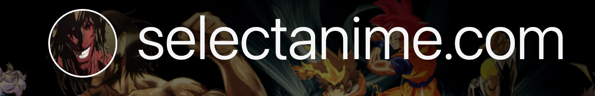

# SelectAnime
## Submission for Microsoft Engage 2022 🌟

Your intelligent Anime Recommender Buddy !

 

 <a target="_blank" href="https://selectanime.herokuapp.com/">Link to the App</a>
    ·
 <a target="_blank" href="https://youtu.be/O7uGtnhZe2s">Video Demo</a>

    
<!-- TABLE OF CONTENTS -->

  
Table of Contents

  <ol>
    <li>
      <a href="#about-the-project">About The Project</a>
      <ul>
        <li><a href="#salient-features">Salient Features</a></li>
        <li><a href="#compatible-platforms">Compatible Platforms</a></li>
        <li><a href="#technologies-used">Technologies Used</a></li>
      </ul>
    <li>
      <a href="#getting-started">Getting Started</a>
      <ul>
        <li><a href="#installation">Installation</a></li>
      </ul>
    </li>
    <li><a href="#navigating-through-the-app">Navigating Through The App</a></li><ul>
        <li><a href="#select-anime--web-appliaction">Select-Anime  Web appliaction</a></li>
        <li><a href="#anime-reommendation-machine-learning-model">Anime Reommendation Machine learning model</a></li>
      </ul>
    <li><a href="#resources-used">Resources Used</a></li>
  </ol>

<!-- ABOUT THE PROJECT -->

## About The Project
* SelectAnime is my project that I built during Microsoft Engage 2022 program. 
* It is a Content Based Anime Recommender System which is an end to end unsupervised ML project built using React and Django and deployed to Heroku Cloud Platform. 
* Created to help Anime lovers make better choice and help buissness of streaming platforms grow .

### Salient Features
* User can select animes from a database of 12,294 anime
* This data set contains information on user preference data from 73,516 users.Each user is able to add anime to their completed list and give it a rating and this data set is a compilation of those ratings.
* User can also search their favourite anime and get recommendations from the model which provides us with more than 20 choices .
 
### Compatible Platforms
Laptops, Desktops and Tablet PCs

### Technologies Used

  <a href="https://www.w3schools.com/css/" target="_blank">         </a>  </a> 

<!-- installing the project -->
## Getting Started

 ### Installation

1. `git clone https://selectanime.herokuapp.com/` 
2. `cd ./selectanime`
3. Install node dependencies 
   - `npm install`
4. Create a `.env` file 
   - Add relevant credentials
   - `cp .env.example .env` 
5. `python manage.py runserver`
6. The app is now running at http://127.0.0.1:8000

<!-- APP TUTORIAL-->
## Navigating Through The App

## Select-Anime  Web appliaction

1.  To use my app, you can directly go to `https://selectanime.herokuapp.com/` and access the recommedation system application. 

2.  User can also search various animes of his/her choice and the search algorithm gives results in milliseconds also after searching user can get recommnedations down below.

https://user-images.githubusercontent.com/82705387/170839999-04374f9c-77e5-4b4d-91c7-17fd66b82d8d.mov

3. The process of input , output and display of results are completely seamless and the recommedation provided by the algorithm are quite accurate according to user experience.
  
## Anime Recommendation Machine learning model

Objectives of the project -

1.   Meet and greet data — Konnichiwa (こんにちわ)
2.   Analyze the data- Byakugan (白ガン)
3.   Preparing data for consumption- Sonaeru (備える)
4.   Recommendation building phase — Tsukuru (作る)

Combined these 4 pointers and created a highly accurate anime recomender system using content based and collaborative filtering. Used a dataset of information on user preference data from 73,516 users on 12,294 anime. After creating the model I have integrated it with the front end of the website which was built using ReactJS by using django framework and deployed the final app on Heroku cloud platform.
  
 <!-- ACKNOWLEDGEMENTS -->

## Resources Used

*
